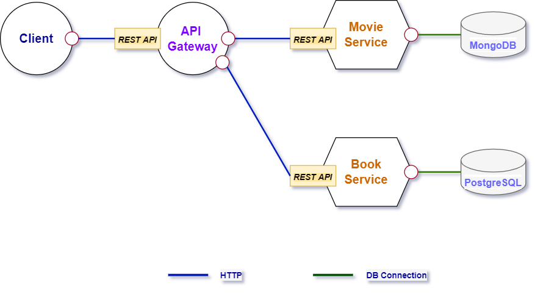
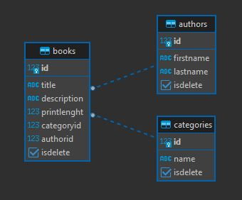
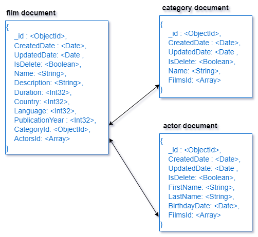

<div align="center">
  
[](https://github.com/muhammetcagatay/microservice-api#electric_plug-installation)
[](https://github.com/emalderson/ThePhish/blob/master/LICENSE)
[](https://github.com/muhammetcagatay/microservice-api)
  
</div>


<!-- PROJECT LOGO -->
<br />
<div align="center">
  <a href="https://github.com/muhammetcagatay/VivaceAPI">
    
  </a>

  <p align="center">

  </p>
</div>


<!-- TABLE OF CONTENTS -->
<details>
  <summary>Table of Contents</summary>
  <ol>
    <li><a href="#beginner-about-the-project">About The Project</a></li>
    <li><a href="#-features">Features</a></li>
    <li><a href="#hammer-built-with">Built With</a></li>
    <li><a href="#electric_plug-installation">Installation</a></li>
    <li><a href="#file_folder-file-structure">File Structure</a></li>
    <li><a href="#nut_and_bolt-database-design">Database Design</a></li>
    <li><a href="#earth_americas-endpoints">Endpoints</a></li>
    <li><a href="#rocket-roadmap">Roadmap</a></li>
    
  </ol>
</details>


<!-- ABOUT THE PROJECT -->
## :beginner: About The Project

<div align="center">



</div>


The main idea of ​​creating this project is to implement Microservices Architecture with  latest technology such as .Net 6, MongoDB, PostgreSQL, Docker. There are two services and one API Gateway in the project.

* The Movie service uses MongoDB as its database. Movie service is a service that allows us to process movies, actors and categories.
* The book service uses PostgreSQL as its database. The Book service is a service that allows us to perform operations on books, authors and categories.
* API Gateway is an API Management tool that stands between clients and microservices. Ocelot used as library in API Gateway


## 🎯 Features
Topics that I aim to learn while developing the project
-   [Microservices Architecture](https://github.com/muhammetcagatay/microservice-api/tree/master/src)
-   [Rest API](https://github.com/muhammetcagatay/microservice-api/tree/master/src/Movie/Movie.API)
-   [Logging](https://github.com/muhammetcagatay/microservice-api/blob/master/src/Movie/Movie.API/Logging/CustomLoggerFactory.cs)
-   [Middlewares](https://github.com/muhammetcagatay/microservice-api/tree/master/src/Movie/Movie.API/Middlewares)
-   [Filters](https://github.com/muhammetcagatay/microservice-api/blob/master/src/Book/Book.API/Filters/NotFoundFilter.cs)
-   [API Gateway](www.empty.com)
-   [Repository Pattern](https://github.com/muhammetcagatay/microservice-api/tree/master/src/Movie/Movie.API/Data)
-   [AutoMapper](https://github.com/muhammetcagatay/microservice-api/tree/master/src/Book/Book.API/Mapper)
-   [Options Pattern](https://github.com/muhammetcagatay/microservice-api/tree/master/src/Movie/Movie.API/Models/Settings)
-   [Swagger Integration](https://github.com/muhammetcagatay/microservice-api/blob/master/src/Book/Book.API/Program.cs)
-   [UnitOfWork Pattern](https://github.com/muhammetcagatay/microservice-api/tree/master/src/Book/Book.API/Data/UnitOfWorks)

## :hammer: Built With

You can take a look at the programming languages, frameworks, databases and other tools I used while developing the project below.

* [.Net Core](https://docs.microsoft.com/tr-tr/dotnet/core/introduction)
* [Docker](https://www.docker.com)
* [MongoDB](https://www.mongodb.com)
* [PostgreSQL](https://www.postgresql.org)
* [Postman](https://www.postman.com)
* [DBeaver](https://dbeaver.io)
* [EF Core](https://docs.microsoft.com/tr-tr/ef/core/)
* [Ocelot](https://github.com/ThreeMammals/Ocelot)


## :electric_plug: Installation

1. Clone the repo
   ```sh
   git clone https://github.com/muhammetcagatay/microservice-api.git
   ```
2. Go to project folder
   ```sh
   cd microservice-api
   ```
3. Docker compose
   ```sh
   docker-compose up
   ```


<!-- GETTING STARTED -->


## :file_folder: File Structure

Add a file structure here with the basic details about files, below is an example.

```
├── src
│   ├── Movie
│   │   ├── Movie.API
│   │   └── Movie.sln
│   ├── Book
│   │   ├── Book.API
│   │   └── Book.sln
│   ├── Gateway
│   │   ├── APIGateway
│   │   └── APIGateway.sln
├── .gitattributes
├── .gitignore
├── README.md
├── docker-compose.override.yml
└── docker-compose.yml
```


## :nut_and_bolt: Database Design

#### BookDB Database Diagram



<br>

#### MovieDB Normalized Data Models



<!-- Endpoints -->
## :earth_americas: Endpoints
Listening and serving HTTP on :5000

### Book Service

| Method | URL | Description |
| --- | --- | --- |
| `GET` | `services/book/authors` | `List of all authors` |
| `GET` | `services/book/authors/1` | `Returns the author with id 1` |
| `GET` | `services/book/authors/getwithbooks/1` | `Returns the movies with the author` |
| `Post` | `services/book/authors` | `Adds new author` |
| `Put` | `services/book/authors/1` | `Updates the author` |
| `Delete` | `services/book/authors/1` | `Delete the author` |


### Movie Service

| Method | URL | Description |
| --- | --- | --- |
| `GET` | `services/movie/films` | `List of all films` |
| `GET` | `services/movie/films/1` | `Returns the film with id 1` |
| `GET` | `services/movie/films/getwithactors/1` | `Returns the actors with the film` |
| `Post` | `services/movie/films` | `Adds new film` |
| `Put` | `services/movie/films/1` | `Updates the film` |
| `Delete` | `services/movie/films/1` | `Delete the film` |


<!-- ROADMAP -->
## :rocket: Roadmap

- [x] Develop Book service
- [x] Develop Movie service
- [x] Develop API Gateway
- [x] Dockerize the project
- [x] Documentation


<!-- MARKDOWN LINKS & IMAGES -->
<!-- https://www.markdownguide.org/basic-syntax/#reference-style-links -->
[contributors-shield]: https://img.shields.io/github/contributors/othneildrew/Best-README-Template.svg?style=for-the-badge
[contributors-url]: https://github.com/othneildrew/Best-README-Template/graphs/contributors
[forks-shield]: https://img.shields.io/github/forks/othneildrew/Best-README-Template.svg?style=for-the-badge
[forks-url]: https://github.com/othneildrew/Best-README-Template/network/members
[stars-shield]: https://img.shields.io/github/stars/othneildrew/Best-README-Template.svg?style=for-the-badge
[stars-url]: https://github.com/othneildrew/Best-README-Template/stargazers
[issues-shield]: https://img.shields.io/github/issues/othneildrew/Best-README-Template.svg?style=for-the-badge
[issues-url]: https://github.com/othneildrew/Best-README-Template/issues
[license-shield]: https://img.shields.io/github/license/othneildrew/Best-README-Template.svg?style=for-the-badge
[license-url]: https://github.com/othneildrew/Best-README-Template/blob/master/LICENSE.txt
[linkedin-shield]: https://img.shields.io/badge/-LinkedIn-black.svg?style=for-the-badge&logo=linkedin&colorB=555
[linkedin-url]: https://linkedin.com/in/othneildrew
[product-screenshot]: images/screenshot.png

